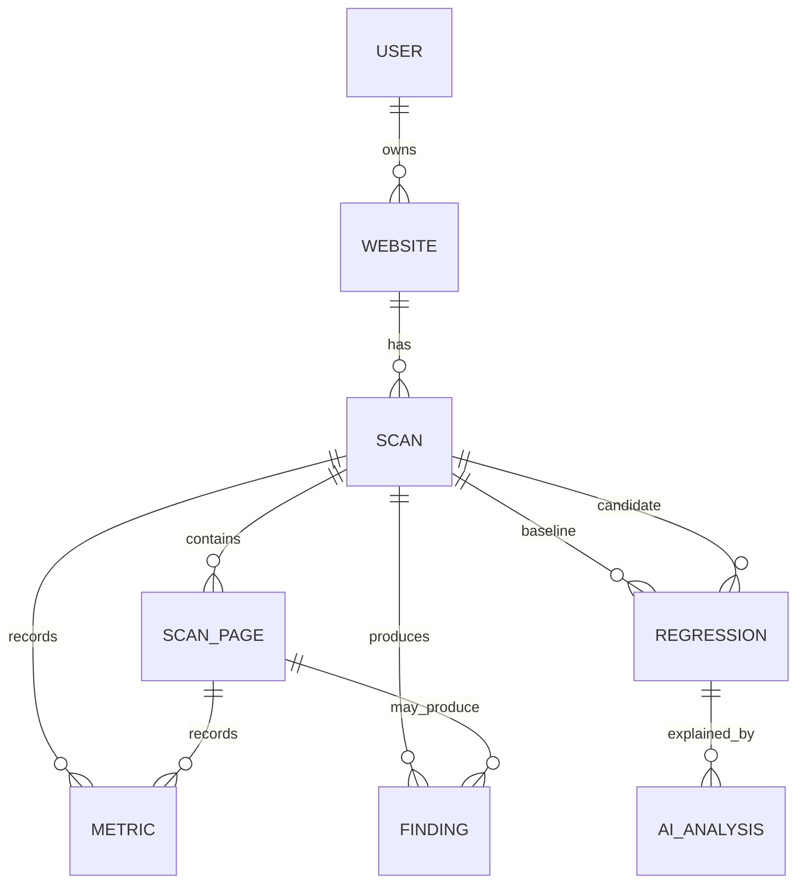

# Conceptual Data Model

## Quyền thiết kế hiện tại

[Cổng kiểm soát thiết kế cơ sở dữ liệu](database/DESIGN_GATES.md) đã được người
dùng phê duyệt sẽ chi phối mọi công việc database tiếp theo và thay thế các quyền
thiết kế schema trước đây. Sơ đồ, bản ghi dự kiến và cân nhắc về index bên dưới
chỉ là ghi chú khái niệm lịch sử, không phải thiết kế cuối cùng đã được duyệt cho
các bảng RED. Không chuyển chúng thành migration hoặc entity. `websites` và
`scans` hiện có tiếp tục được đóng băng.

- [Thiết kế và triển khai định danh GREEN](database/GREEN_IDENTITY.md)
- [Đề xuất YELLOW đang chờ phê duyệt](database/YELLOW_PROPOSALS.md)
- [Mẫu thu thập workload RED](database/RED_WORKLOAD_TEMPLATE.md)
- [Hồ sơ workload và độ tin cậy V1/V1.5](database/WORKLOAD_PROFILE_V1_V1_5.md)
- [Bộ quyết định trước schema microservice đang chờ duyệt](database/MICROSERVICE_SCHEMA_DECISIONS.md)
- [Bộ quyết định hybrid PostgreSQL/ClickHouse đã duyệt](database/HYBRID_POSTGRES_CLICKHOUSE_DECISIONS.md)
- [Schema hybrid PostgreSQL/ClickHouse đã duyệt](database/V1_V1_5_HYBRID_SCHEMA_PROPOSAL.md)
- [Benchmark hybrid để kiểm thử](database/V1_V1_5_HYBRID_BENCHMARK_QUERIES.md)
- [Gói Flyway/ClickHouse migration review](database/migrations-review/README.md)
- [Bản schema PostgreSQL-only lịch sử](database/V1_V1_5_SCHEMA_PROPOSAL.md)
- [Bộ benchmark PostgreSQL-only lịch sử](database/V1_V1_5_BENCHMARK_QUERIES.md)

ADR-005 và ADR-006 ngày 2026-09-11 thay đổi data ownership: Control Plane,
Crawler Service và Capture Worker không dùng chung bảng private, foreign key hoặc
transaction; analytical facts khối lượng lớn chuyển sang ClickHouse theo owner.
Vì vậy bản schema V1/V1.5 và sơ đồ quan hệ lịch sử bên dưới phải được thiết kế lại
trước implementation. Các cạnh trong sơ đồ chỉ thể hiện liên hệ domain bằng opaque
identifier, không mặc nhiên là foreign key vật lý xuyên service.

The V1/V1.5 core ends at Scan, ScanPage, Metric, and Finding. Regression and AIAnalysis below are forward-looking extensions for V2 and V3; they must not be introduced into the initial schema before their task specifications and acceptance criteria exist.

The schema must be designed with the first implementation tasks and introduced through Flyway. Names below are candidates, not a finalized migration.

## Candidate records

- `users`: identity, status, credential reference/material appropriate to the chosen auth mechanism, created/updated timestamps.
- `websites`: owner, normalized URL components, display name, status, timestamps.
- `scans`: website, state, configuration snapshot, collector version, progress counters, queued/started/finished timestamps, terminal reason.
- `scan_pages`: scan, normalized URL, discovery source/depth, outcome, HTTP metadata, timing, error classification.
- `metrics`: scan and optional page subject, name, numeric/text value as deliberately modeled, unit, collection version.
- `findings`: scan and optional page subject, rule/version, category, severity, evidence payload/reference.
- `regressions` (V2 candidate): website, baseline scan, candidate scan, subject, rule/version, severity, baseline/candidate evidence.
- `ai_analyses` (V3 candidate): regression/evidence reference, status, provider/model metadata, prompt-template version, output, timestamps, failure classification.

## Modeling guidance

- Prefer opaque generated IDs (UUID/UUIDv7 or database-generated numeric IDs) consistently; choose after evaluating index locality, exposure, and operational needs.
- Store timestamps as timezone-aware instants and set them server-side. Preserve scan-specific event timestamps, not only generic audit timestamps.
- Represent scan state with enforced allowed values and guarded transitions. Progress is derived or updated atomically and must remain within the scan's bounds.
- Preserve historical measurements with units and collection/rule versions so old results remain interpretable. Do not overwrite scan evidence.
- Use structured columns for stable queryable fields; use JSON only for genuinely evolving evidence/configuration and validate its shape.

## Index considerations

Likely access paths include websites by owner, scans by website and creation time, pages by scan and normalized URL, metrics by scan/page/name/version, and regressions by candidate scan/severity. Add uniqueness for normalized website targets per owner and normalized page URL per scan if domain rules require it. Confirm every index against actual queries and write volume.

## Retention questions

Before schema finalization decide: whether users can delete or archive websites; retention for page bodies, headers, metrics, AI prompts/outputs, and failed scans; deletion propagation; export requirements; and whether aggregated history can outlive raw evidence. Default to minimizing retention of untrusted or sensitive response content.
