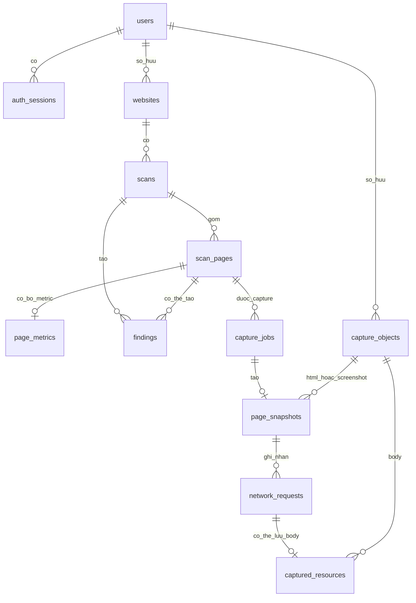

# Đề xuất schema PostgreSQL cho V1 và V1.5

> **Trạng thái: cần thiết kế lại sau ADR-005/ADR-006, không được triển khai.** Bản proposal
> này được viết theo giả định một database owner và dùng nhiều foreign key/
> transaction xuyên `scans`, `scan_pages`, metrics, findings và capture metadata.
> Từ ngày 2026-09-11, Control Plane, Crawler Service và Capture Worker có
> persistence ownership riêng và analytical facts đã chuyển sang ClickHouse; vì
> vậy DDL bên dưới chỉ còn là tài liệu lịch sử để
> đối chiếu. Không tạo Flyway migration, crawler migration, JPA entity hoặc runtime
> code từ DDL này. Workload, contract, PK/FK/index/transaction phải được review lại
> theo từng service và không có cross-service FK/transaction.
> Bản thay thế hiện hành là
> [schema hybrid PostgreSQL/ClickHouse](V1_V1_5_HYBRID_SCHEMA_PROPOSAL.md).

Trạng thái lịch sử trước ADR-005: **bản thiết kế để review, chưa được phê duyệt
triển khai**. Các quyết định ở cuối tài liệu chưa được duyệt và hiện còn phải
được phân bổ lại theo data owner trước khi review tiếp.

Database đích lịch sử là PostgreSQL 17.x tự triển khai. Baseline hiện hành là
PostgreSQL + ClickHouse + S3/MinIO theo ADR-006; không dùng DDL trong tài liệu này
để triển khai baseline mới.

## 1. Phạm vi theo phiên bản

| Phiên bản | Use case | Bảng |
| --- | --- | --- |
| V1 | Đăng ký, đăng nhập, refresh và thu hồi session | `users`, `auth_sessions` |
| V1 | Đăng ký, liệt kê, đổi tên và archive website | `websites` |
| V1 | Tạo, xếp hàng, theo dõi, hủy và giữ lịch sử scan | `scans` |
| V1 | Dedup URL, claim công việc, retry và lưu page outcome | `scan_pages` |
| V1 | Lưu bộ metric có version cho từng page | `page_metrics` |
| V1 | Lưu finding deterministic có rule version | `findings` |
| V1 | Lưu graph link đầy đủ | `page_links` — đề nghị **chưa triển khai** |
| V1.5 | Xếp hàng, lease, retry và hủy browser capture | `capture_jobs` |
| V1.5 | Lưu metadata một rendered snapshot | `page_snapshots` |
| V1.5 | Lưu metadata network đã giới hạn và đã redaction | `network_requests` |
| V1.5 | Gắn resource body hợp lệ với object đã lưu | `captured_resources` |
| V1.5 | Quản lý metadata, hash và vòng đời object S3/MinIO | `capture_objects` — bảng phụ RED mới đề xuất |

`regressions` bắt đầu ở V2. Các bảng YELLOW như `ai_analyses`, `monitors`,
`alerts` và các bảng knowledge/model/reconstruction không thuộc V1/V1.5 nên
không xuất hiện trong schema này.

## 2. Bước 1–7 bắt buộc trước schema

### 2.1 Identity và website

**Yêu cầu nghiệp vụ.** User có thể đăng nhập, thu hồi session và chỉ truy cập
website thuộc mình. Website được chuẩn hóa, chỉ dùng HTTP(S), không fetch trong
bước validation và có thể archive mà không xóa lịch sử ngay lập tức.

**Workload và volume.** Mốc đã duyệt là 100.000 tài khoản, 10.000 DAU, 1.000
client đồng thời và API burst 1.000 RPS. Để benchmark website, bản thiết kế dùng
giả thuyết cần duyệt: trung bình 3 website/user, p95 10, safety limit 25, tương
đương khoảng 300.000 website.

**Query pattern.** Tra user bằng normalized email; khóa session theo ID khi
rotate/revoke; lấy website bằng `(id, owner_id)`; liệt kê website active theo
owner bằng cursor; kiểm tra URL active trùng; lấy latest scan của một tập website.

**Write pattern.** Identity chủ yếu là OLTP đơn dòng. Refresh token dùng row lock
ngắn. Website có write thấp hơn scan nhiều lần; rename/archive dùng optimistic
version hoặc row lock khi cần phối hợp với active scan.

**Consistency/concurrency.** Email normalized phải unique. Refresh rotation phải
single-use. Không được có hai website active cùng canonical URL trong một owner.
Archive cạnh tranh với create scan phải có một thứ tự commit xác định.

**Retention.** Session hết hạn được xóa theo batch. Website archive vẫn tồn tại
để giữ scan summary; yêu cầu xóa hợp lệ được purge trong 7 ngày sau khi xử lý các
quan hệ lịch sử theo policy.

### 2.2 Crawl, page metrics và findings

**Yêu cầu nghiệp vụ.** Một scan được persist trước khi chạy, tối đa 100 page,
respects `robots.txt`, ghi outcome rõ ràng cho từng page, progress có thể trễ tối
đa 2 giây, partial không bị trình bày như complete và cancellation thắng mọi
late result commit sau nó.

**Workload.** Đã duyệt khoảng 20.000 scan/ngày, trung bình 30 page/scan, p95 80,
600.000 scan page/ngày, peak 200 page completion/giây và 100–300 crawl worker.
Mỗi user tối đa 3 active scan, mỗi website tối đa 1 active scan.

**Query pattern.** Tạo scan idempotent; lấy progress theo owner/id; lịch sử scan
mới nhất trước; claim scan/page; reclaim lease hết hạn; list page theo status bằng
cursor; lấy page detail, metric và finding; tìm aggregate đến hạn retention.

**Write pattern.** Scan được tạo một lần. Worker claim bằng transaction ngắn,
fetch mạng ngoài transaction, sau đó commit outcome nếu fencing generation còn
hợp lệ. `scan_pages` là nguồn sự thật. Counter trong `scans` được projector gom
tối đa mỗi 2 giây, không update một hot row sau mỗi page completion.

**Volume.** Với retention detail 180 ngày, baseline là khoảng 108 triệu
`scan_pages` và tối đa cùng bậc cho `page_metrics`. Để capacity-test `findings`,
giả thuyết cần duyệt là trung bình 2 finding/page và hard cap 50/page, tương đương
khoảng 216 triệu finding trong 180 ngày ở mức trung bình.

**Consistency/concurrency.** At-least-once, tối đa 3 attempt logic, claim bằng
`FOR UPDATE SKIP LOCKED`, fencing generation tăng đơn điệu, duplicate completion
không double-count. State terminal không quay lại running. Một URL normalized chỉ
tạo một page logic trong một scan. URL sau redirect là evidence ở `final_url`,
không đổi identity của page.

**Retention.** `scans` summary 365 ngày; page, metric và finding detail 180 ngày.
Sau khi detail bị purge, scan summary vẫn giữ counters và collector/config version.

### 2.3 Browser capture và object storage

**Yêu cầu nghiệp vụ.** Capture job được persist trước khi chạy. Chromium và
upload object chạy ngoài database transaction. PostgreSQL chỉ giữ metadata và
object reference; HTML/JS không được viewer thực thi; header/payload nhạy cảm
không được lưu mặc định.

**Workload.** Đã duyệt 10 browser worker, 0,2 capture/giây duy trì và burst 2
capture/giây. Các giả thuyết cần duyệt cho benchmark là 100 network request/capture
trung bình, p95 300, hard cap 500; 20 resource body được giữ/capture trung bình,
hard cap 100; tối đa 50 MiB object mới cho một capture.

**Query pattern.** Tạo capture idempotent; kiểm tra active capture trên page;
claim/reclaim job; lấy job progress; lấy snapshot theo owner/job; list network và
resource bằng cursor/filter; lookup object theo owner/hash; tìm object orphan hoặc
đến hạn lifecycle.

**Write pattern.** Worker claim job, render và upload ngoài transaction, rồi dùng
một transaction ngắn để gắn object metadata, snapshot, network/resource metadata
và complete job. Kết quả stale bị fencing từ chối. Batch metadata 100–500 row,
không INSERT từng network event bằng từng transaction.

**Volume.** Nếu giữ liên tục 0,2 capture/giây thì có khoảng 17.280 capture/ngày.
Với các giả thuyết trên và 180 ngày retention: khoảng 3,1 triệu snapshot, 311
triệu network row và 62 triệu captured-resource row trước dedup. Dung lượng binary
chưa thể tính chính xác nếu chưa có byte trung bình/capture; hard cap chỉ là van
an toàn, không phải capacity average.

**Consistency/concurrency.** Một active capture/page, tối đa 2 active capture/user,
tối đa 3 attempt. Lease heartbeat 15 giây, lease hết hiệu lực sau 60 giây và mục
tiêu reassign không quá 120 giây là giả thuyết cần duyệt. Hash dedup chỉ diễn ra
trong cùng owner để tránh side channel xuyên tenant.

**Retention.** Giả thuyết cần duyệt: capture job summary 365 ngày; snapshot,
network/resource metadata và object body 180 ngày; purge hợp lệ trong 7 ngày.
Object storage lifecycle không được xóa object còn reference hợp lệ trong DB.

## 3. Các phương án schema và lựa chọn đề xuất

### 3.1 Progress scan

| Phương án | Ưu điểm | Nhược điểm | Kết luận |
| --- | --- | --- | --- |
| Mỗi worker tăng counter trên `scans` | Đọc progress rất nhanh | Hot row, lock wait và WAL cao | Loại |
| Mỗi lần đọc đều đếm `scan_pages` | Không có counter lệch | Tốn CPU/IO khi polling lớn | Loại cho control plane |
| Page là source of truth, counter là projection | Đọc nhanh, write được gom, có thể reconcile | Progress trễ tối đa 2 giây | **Chọn** |

### 3.2 Queue và retry

| Phương án | Kết luận |
| --- | --- |
| Queue chỉ ở memory | Không bền qua restart, loại |
| Thêm generic queue dùng chung mọi domain | Quá trừu tượng và làm yếu FK/invariant, loại |
| `scans`, `scan_pages`, `capture_jobs` tự mang queue/lease/fence | **Chọn cho V1/V1.5** |
| Lưu một row cho từng physical attempt | Chỉ cần khi audit/debug requirement xuất hiện; tạm hoãn |

### 3.3 Metric

- EAV một row cho từng metric làm số row/index tăng mạnh và type safety yếu.
- Wide table chứa metric ổn định cho mỗi page nhanh hơn cho report.
- Đề xuất wide typed columns cộng một JSONB nhỏ, có schema version, cho metric
  thử nghiệm chưa đủ ổn định. Không tạo GIN index trên JSONB trước khi có query.

### 3.4 URL dài

Không dùng URL dài làm B-tree unique key. Mỗi URL vẫn được lưu nguyên văn để hiển
thị, đồng thời application tính SHA-256 32 byte trên chuỗi normalized. Unique key
dùng hash; khi gặp conflict application đọc và so sánh URL đầy đủ để phát hiện
collision lý thuyết.

### 3.5 Partition

Baseline 108–311 triệu row đã vượt ngưỡng nên đề xuất hash partition theo aggregate
key ngay từ đầu:

- `scan_pages`, `page_metrics`, `findings`: `HASH (scan_id)`.
- `network_requests`, `captured_resources`: `HASH (snapshot_id)`.
- `capture_objects`: `HASH (owner_id)`.

Query chính luôn có aggregate key nên partition pruning hiệu quả. Hash partition
không giúp drop retention theo thời gian; retention vẫn xóa theo scan/snapshot
bằng batch nhỏ và autovacuum riêng từng partition. Đề xuất ban đầu là 32 partition,
nhưng số cuối cùng phải do benchmark 8/16/32 quyết định. Primary/unique key luôn
bao gồm partition key.

### 3.6 `page_links`

SCAN-002 cần discovery/dedup, nhưng REPORT-001 không yêu cầu người dùng xem full
link graph. `scan_pages.discovered_from_page_id` đã giữ parent discovery đủ cho
V1. Lưu mọi link có thể tạo hàng tỷ row và write amplification không mang lại use
case thị trường hiện tại. Vì vậy đề xuất **không tạo `page_links` trong V1/V1.5**.
Khi sản phẩm có link graph/broken-link use case, bảng này phải quay lại quy trình
RED với số link/page, filter và retention cụ thể.

### 3.7 Object storage

Chỉ lưu `bucket`, opaque `object_key`, SHA-256, byte length, MIME type và state
trong PostgreSQL. Không lưu presigned URL vì nó hết hạn. Không dùng `ref_count`
mutable vì concurrent retry dễ làm sai; garbage collector xác minh `NOT EXISTS`
reference từ snapshot/resource trước khi chuyển sang delete-pending.

## 4. Quan hệ đề xuất



## 5. Schema chi tiết

### 5.1 `users` — GREEN, giữ nguyên

| Cột | Kiểu | Quy tắc |
| --- | --- | --- |
| `id` | `uuid` | PK, application tạo |
| `email` | `varchar(254)` | email hiển thị, không blank |
| `normalized_email` | `varchar(254)` | lowercase/trim, unique, không blank |
| `display_name` | `varchar(80)` | không blank |
| `password_hash` | `varchar(200)` | chỉ hash, không blank |
| `status` | `varchar(16)` | `ACTIVE`, `DISABLED` |
| `created_at`, `updated_at` | `timestamptz` | `updated_at >= created_at` |
| `version` | `bigint` | optimistic version |

Giữ unique constraint `uq_users_normalized_email`. Không cần index status cho
100.000 user nếu không có admin query đã được chứng minh.

### 5.2 `auth_sessions` — GREEN, giữ nguyên

| Cột | Kiểu | Quy tắc |
| --- | --- | --- |
| `id` | `uuid` | PK, đồng thời là session id |
| `user_id` | `uuid` | FK `users`, `ON DELETE RESTRICT` |
| `refresh_jti_hash` | `varchar(64)` | SHA-256 hex, unique; không lưu raw token |
| `csrf_token_hash` | `varchar(64)` | SHA-256 hex |
| `expires_at`, `revoked_at`, `rotated_at` | `timestamptz` | lifecycle session |
| `created_at` | `timestamptz` | thời điểm tạo |
| `version` | `bigint` | optimistic version |

Giữ partial index `(user_id, expires_at) WHERE revoked_at IS NULL` và index
`expires_at` cho cleanup. Đề xuất bổ sung index đầy đủ `(user_id)` để FK check và
account purge không phải scan toàn bộ session đã revoke. Refresh/revoke tiếp tục
dùng `SELECT ... FOR UPDATE`.

### 5.3 `websites` — RED, mở rộng tương thích

Giữ toàn bộ cột hiện tại. Đề xuất thêm:

| Cột mới | Kiểu | Mục đích |
| --- | --- | --- |
| `canonical_url_hash` | `bytea` | SHA-256 32 byte của canonical URL |

Ràng buộc cuối cùng:

```sql
CHECK (octet_length(canonical_url_hash) = 32);

CREATE UNIQUE INDEX uq_websites_owner_active_url_hash
    ON websites (owner_id, canonical_url_hash)
    WHERE status = 'ACTIVE';
```

Index URL text hiện tại chỉ được bỏ trong một forward migration sau khi backfill,
collision check và unique hash index đã valid. Giữ:

```sql
CREATE INDEX ix_websites_owner_status_updated
    ON websites (owner_id, status, updated_at DESC, id ASC);
```

### 5.4 `scans` — RED, aggregate và durable queue

Giữ cột cấu hình, status, terminal reason, idempotency và counter hiện tại. Đề
xuất thêm:

| Cột mới | Kiểu | Quy tắc |
| --- | --- | --- |
| `queue_priority` | `smallint` | 0–1000, mặc định 100 |
| `available_at` | `timestamptz` | thời điểm sớm nhất được claim |
| `attempt_count` | `smallint` | 0–3 |
| `lease_owner` | `varchar(128)` | nullable |
| `lease_generation` | `bigint` | tăng nguyên tử mỗi lần claim, không giảm |
| `lease_expires_at` | `timestamptz` | nullable; đi cùng `lease_owner` |
| `cancel_requested_at` | `timestamptz` | có khi status từ `CANCEL_REQUESTED` trở đi |
| `skipped_count` | `integer` | page bị bỏ qua có chủ đích, không trộn với lỗi |
| `cancelled_count` | `integer` | page dừng do cancellation |
| `progress_revision` | `bigint` | revision projection, không giảm |
| `progress_calculated_at` | `timestamptz` | freshness của progress |
| `detail_expires_at` | `timestamptz` | mặc định nghiệp vụ: created + 180 ngày |
| `detail_purged_at` | `timestamptz` | xác nhận detail đã purge |
| `summary_expires_at` | `timestamptz` | mặc định nghiệp vụ: created + 365 ngày |

Ràng buộc/index mới đề xuất:

```sql
CHECK (queue_priority BETWEEN 0 AND 1000);
CHECK (attempt_count BETWEEN 0 AND 3);
CHECK (lease_generation >= 0);
CHECK (skipped_count >= 0 AND cancelled_count >= 0);
CHECK (
    processed_count = succeeded_count + failed_count
                    + skipped_count + cancelled_count
);
CHECK (
    (lease_owner IS NULL AND lease_expires_at IS NULL)
    OR (lease_owner IS NOT NULL AND lease_expires_at IS NOT NULL)
);
CHECK (detail_expires_at <= summary_expires_at);

CREATE UNIQUE INDEX uq_scans_one_active_per_website
    ON scans (website_id)
    WHERE status IN ('QUEUED', 'RUNNING', 'CANCEL_REQUESTED');

CREATE INDEX ix_scans_claim
    ON scans (queue_priority DESC, available_at, created_at, id)
    WHERE status = 'QUEUED';

CREATE INDEX ix_scans_expired_lease
    ON scans (lease_expires_at, id)
    WHERE status IN ('RUNNING', 'CANCEL_REQUESTED');

CREATE INDEX ix_scans_detail_retention
    ON scans (detail_expires_at, id)
    WHERE detail_purged_at IS NULL;

CREATE INDEX ix_scans_user_active
    ON scans (requested_by_user_id, created_at, id)
    WHERE status IN ('QUEUED', 'RUNNING', 'CANCEL_REQUESTED');

ALTER TABLE scans
    ADD CONSTRAINT uq_scans_id_requester
    UNIQUE (id, requested_by_user_id);
```

Constraint `processed_count = succeeded_count + failed_count` hiện tại phải được
thay bằng constraint bốn nhóm terminal ở trên bằng forward migration an toàn.
Index history hiện tại `(requested_by_user_id, website_id, created_at DESC,
id DESC)` tiếp tục phục vụ keyset pagination. Counter trên bảng này là projection,
không phải nguồn sự thật độc lập.

### 5.5 `scan_pages` — RED, source of truth và page queue

DDL logic:

```sql
CREATE TABLE scan_pages (
    scan_id UUID NOT NULL,
    id UUID NOT NULL,
    discovered_from_page_id UUID,
    normalized_url TEXT NOT NULL,
    normalized_url_hash BYTEA NOT NULL,
    requested_url TEXT NOT NULL,
    final_url TEXT,
    final_url_hash BYTEA,
    depth SMALLINT NOT NULL,
    status VARCHAR(16) NOT NULL,
    queue_priority SMALLINT NOT NULL DEFAULT 100,
    available_at TIMESTAMPTZ NOT NULL,
    attempt_count SMALLINT NOT NULL DEFAULT 0,
    lease_owner VARCHAR(128),
    lease_generation BIGINT NOT NULL DEFAULT 0,
    lease_expires_at TIMESTAMPTZ,
    http_status SMALLINT,
    content_type VARCHAR(255),
    response_bytes BIGINT,
    redirect_count SMALLINT NOT NULL DEFAULT 0,
    error_code VARCHAR(64),
    error_message VARCHAR(500),
    created_at TIMESTAMPTZ NOT NULL,
    started_at TIMESTAMPTZ,
    finished_at TIMESTAMPTZ,
    updated_at TIMESTAMPTZ NOT NULL,
    PRIMARY KEY (scan_id, id),
    FOREIGN KEY (scan_id) REFERENCES scans (id) ON DELETE CASCADE,
    FOREIGN KEY (scan_id, discovered_from_page_id)
        REFERENCES scan_pages (scan_id, id)
        ON DELETE SET NULL (discovered_from_page_id),
    CHECK (octet_length(normalized_url_hash) = 32),
    CHECK (
        (final_url IS NULL AND final_url_hash IS NULL)
        OR (final_url IS NOT NULL AND octet_length(final_url_hash) = 32)
    ),
    CHECK (octet_length(normalized_url) BETWEEN 1 AND 8192),
    CHECK (octet_length(requested_url) BETWEEN 1 AND 8192),
    CHECK (final_url IS NULL OR octet_length(final_url) BETWEEN 1 AND 8192),
    CHECK (depth BETWEEN 0 AND 10),
    CHECK (status IN ('QUEUED', 'RUNNING', 'SUCCEEDED', 'FAILED', 'SKIPPED', 'CANCELLED')),
    CHECK (queue_priority BETWEEN 0 AND 1000),
    CHECK (attempt_count BETWEEN 0 AND 3),
    CHECK (lease_generation >= 0),
    CHECK (
        (lease_owner IS NULL AND lease_expires_at IS NULL)
        OR (lease_owner IS NOT NULL AND lease_expires_at IS NOT NULL)
    ),
    CHECK (
        (status = 'RUNNING' AND lease_owner IS NOT NULL)
        OR (status <> 'RUNNING' AND lease_owner IS NULL)
    ),
    CHECK (http_status IS NULL OR http_status BETWEEN 100 AND 599),
    CHECK (response_bytes IS NULL OR response_bytes >= 0),
    CHECK (redirect_count BETWEEN 0 AND 10),
    CHECK (updated_at >= created_at),
    CHECK (started_at IS NULL OR started_at >= created_at),
    CHECK (finished_at IS NULL OR finished_at >= created_at),
    CHECK (
        (status IN ('SUCCEEDED', 'FAILED', 'SKIPPED', 'CANCELLED') AND finished_at IS NOT NULL)
        OR (status IN ('QUEUED', 'RUNNING') AND finished_at IS NULL)
    )
) PARTITION BY HASH (scan_id);

CREATE UNIQUE INDEX uq_scan_pages_normalized_url
    ON scan_pages (scan_id, normalized_url_hash);

CREATE INDEX ix_scan_pages_claim
    ON scan_pages (scan_id, queue_priority DESC, available_at, id)
    WHERE status = 'QUEUED';

CREATE INDEX ix_scan_pages_report
    ON scan_pages (scan_id, status, id);

CREATE INDEX ix_scan_pages_expired_lease
    ON scan_pages (lease_expires_at, scan_id, id)
    WHERE status = 'RUNNING';

CREATE INDEX ix_scan_pages_discovery_parent
    ON scan_pages (scan_id, discovered_from_page_id)
    WHERE discovered_from_page_id IS NOT NULL;
```

UUID mới nên là UUIDv7 do application tạo để cải thiện locality trên PostgreSQL
17 mà không bắt buộc extension. UUIDv4 hiện hữu vẫn hợp lệ vì cùng kiểu `uuid`.

### 5.6 `page_metrics` — RED, một bộ metric cho mỗi page/version

```sql
CREATE TABLE page_metrics (
    scan_id UUID NOT NULL,
    scan_page_id UUID NOT NULL,
    metric_schema_version VARCHAR(32) NOT NULL,
    collector_version VARCHAR(64) NOT NULL,
    collection_status VARCHAR(16) NOT NULL,
    failure_code VARCHAR(64),
    dns_us BIGINT,
    connect_us BIGINT,
    tls_us BIGINT,
    ttfb_us BIGINT,
    download_us BIGINT,
    total_us BIGINT,
    transferred_bytes BIGINT,
    decoded_body_bytes BIGINT,
    dom_nodes INTEGER,
    link_count INTEGER,
    resource_count INTEGER,
    extra_metrics JSONB NOT NULL DEFAULT '{}'::jsonb,
    measured_at TIMESTAMPTZ NOT NULL,
    PRIMARY KEY (scan_id, scan_page_id, metric_schema_version),
    FOREIGN KEY (scan_id, scan_page_id)
        REFERENCES scan_pages (scan_id, id) ON DELETE CASCADE,
    CHECK (btrim(metric_schema_version) <> ''),
    CHECK (btrim(collector_version) <> ''),
    CHECK (collection_status IN ('AVAILABLE', 'PARTIAL', 'FAILED')),
    CHECK (collection_status <> 'FAILED' OR failure_code IS NOT NULL),
    CHECK (jsonb_typeof(extra_metrics) = 'object'),
    CHECK (octet_length(extra_metrics::text) <= 16384),
    CHECK (dns_us IS NULL OR dns_us >= 0),
    CHECK (connect_us IS NULL OR connect_us >= 0),
    CHECK (tls_us IS NULL OR tls_us >= 0),
    CHECK (ttfb_us IS NULL OR ttfb_us >= 0),
    CHECK (download_us IS NULL OR download_us >= 0),
    CHECK (total_us IS NULL OR total_us >= 0),
    CHECK (transferred_bytes IS NULL OR transferred_bytes >= 0),
    CHECK (decoded_body_bytes IS NULL OR decoded_body_bytes >= 0),
    CHECK (dom_nodes IS NULL OR dom_nodes >= 0),
    CHECK (link_count IS NULL OR link_count >= 0),
    CHECK (resource_count IS NULL OR resource_count >= 0)
) PARTITION BY HASH (scan_id);
```

Không thêm index riêng cho từng metric ở V1. Report đọc theo một scan/page. Nếu
sau này có query time-series theo website và metric, đó là workload V2 và cần
index/rollup riêng.

### 5.7 `findings` — RED, append-only deterministic result

```sql
CREATE TABLE findings (
    scan_id UUID NOT NULL,
    id BIGINT GENERATED ALWAYS AS IDENTITY,
    scan_page_id UUID,
    rule_code VARCHAR(64) NOT NULL,
    rule_version VARCHAR(32) NOT NULL,
    finding_key VARCHAR(128) NOT NULL,
    category VARCHAR(32) NOT NULL,
    severity VARCHAR(16) NOT NULL,
    title VARCHAR(200) NOT NULL,
    message TEXT NOT NULL,
    evidence JSONB NOT NULL DEFAULT '{}'::jsonb,
    created_at TIMESTAMPTZ NOT NULL,
    PRIMARY KEY (scan_id, id),
    FOREIGN KEY (scan_id) REFERENCES scans (id) ON DELETE CASCADE,
    FOREIGN KEY (scan_id, scan_page_id)
        REFERENCES scan_pages (scan_id, id) ON DELETE CASCADE,
    CHECK (btrim(rule_code) <> ''),
    CHECK (btrim(rule_version) <> ''),
    CHECK (btrim(finding_key) <> ''),
    CHECK (btrim(category) <> ''),
    CHECK (severity IN ('INFO', 'LOW', 'MEDIUM', 'HIGH', 'CRITICAL')),
    CHECK (btrim(title) <> ''),
    CHECK (btrim(message) <> ''),
    CHECK (jsonb_typeof(evidence) = 'object'),
    CHECK (octet_length(evidence::text) <= 16384)
) PARTITION BY HASH (scan_id);

CREATE UNIQUE INDEX uq_findings_scan_rule
    ON findings (scan_id, rule_code, rule_version, finding_key)
    WHERE scan_page_id IS NULL;

CREATE UNIQUE INDEX uq_findings_page_rule
    ON findings (scan_id, scan_page_id, rule_code, rule_version, finding_key)
    WHERE scan_page_id IS NOT NULL;

CREATE INDEX ix_findings_report
    ON findings (scan_id, severity, id);
```

`evidence` chỉ chứa evidence nhỏ đã validate, không chứa raw HTML, script hoặc
response body. `finding_key` là khóa deterministic trong phạm vi một rule, cho
phép một rule tạo nhiều finding nhưng retry vẫn idempotent. Không tạo GIN index
khi chưa có containment query cụ thể.

### 5.8 `capture_jobs` — RED, durable browser queue

```sql
CREATE TABLE capture_jobs (
    id UUID PRIMARY KEY,
    owner_id UUID NOT NULL,
    scan_id UUID NOT NULL,
    scan_page_id UUID,
    requested_url TEXT NOT NULL,
    requested_url_hash BYTEA NOT NULL,
    status VARCHAR(24) NOT NULL,
    queue_priority SMALLINT NOT NULL DEFAULT 100,
    available_at TIMESTAMPTZ NOT NULL,
    attempt_count SMALLINT NOT NULL DEFAULT 0,
    lease_owner VARCHAR(128),
    lease_generation BIGINT NOT NULL DEFAULT 0,
    lease_expires_at TIMESTAMPTZ,
    idempotency_key_hash VARCHAR(64),
    request_fingerprint_hash VARCHAR(64),
    cancel_requested_at TIMESTAMPTZ,
    max_duration_seconds SMALLINT NOT NULL,
    max_network_requests INTEGER NOT NULL,
    max_resource_count INTEGER NOT NULL,
    max_resource_bytes BIGINT NOT NULL,
    max_total_object_bytes BIGINT NOT NULL,
    viewport_width SMALLINT NOT NULL,
    viewport_height SMALLINT NOT NULL,
    device_scale_factor NUMERIC(3,2) NOT NULL,
    capture_profile_version VARCHAR(32) NOT NULL,
    terminal_code VARCHAR(64),
    terminal_message VARCHAR(500),
    created_at TIMESTAMPTZ NOT NULL,
    started_at TIMESTAMPTZ,
    finished_at TIMESTAMPTZ,
    updated_at TIMESTAMPTZ NOT NULL,
    summary_expires_at TIMESTAMPTZ NOT NULL,
    version BIGINT NOT NULL DEFAULT 0,
    UNIQUE (owner_id, id),
    FOREIGN KEY (owner_id) REFERENCES users (id) ON DELETE RESTRICT,
    FOREIGN KEY (scan_id, owner_id)
        REFERENCES scans (id, requested_by_user_id) ON DELETE RESTRICT,
    FOREIGN KEY (scan_id, scan_page_id)
        REFERENCES scan_pages (scan_id, id)
        ON DELETE SET NULL (scan_page_id),
    CHECK (octet_length(requested_url) BETWEEN 1 AND 8192),
    CHECK (octet_length(requested_url_hash) = 32),
    CHECK (status IN (
        'QUEUED', 'RUNNING', 'CANCEL_REQUESTED',
        'COMPLETED', 'PARTIAL_SUCCESS', 'FAILED', 'CANCELLED'
    )),
    CHECK (queue_priority BETWEEN 0 AND 1000),
    CHECK (attempt_count BETWEEN 0 AND 3),
    CHECK (lease_generation >= 0),
    CHECK (
        (lease_owner IS NULL AND lease_expires_at IS NULL)
        OR (lease_owner IS NOT NULL AND lease_expires_at IS NOT NULL)
    ),
    CHECK (
        (status IN ('RUNNING', 'CANCEL_REQUESTED') AND lease_owner IS NOT NULL)
        OR (status NOT IN ('RUNNING', 'CANCEL_REQUESTED') AND lease_owner IS NULL)
    ),
    CHECK (
        scan_page_id IS NOT NULL
        OR status IN ('COMPLETED', 'PARTIAL_SUCCESS', 'FAILED', 'CANCELLED')
    ),
    CHECK (
        (idempotency_key_hash IS NULL AND request_fingerprint_hash IS NULL)
        OR (idempotency_key_hash IS NOT NULL AND request_fingerprint_hash IS NOT NULL)
    ),
    CHECK (idempotency_key_hash IS NULL OR idempotency_key_hash ~ '^[0-9a-f]{64}$'),
    CHECK (request_fingerprint_hash IS NULL OR request_fingerprint_hash ~ '^[0-9a-f]{64}$'),
    CHECK (max_duration_seconds BETWEEN 1 AND 180),
    CHECK (max_network_requests BETWEEN 1 AND 500),
    CHECK (max_resource_count BETWEEN 0 AND 100),
    CHECK (max_resource_bytes BETWEEN 1024 AND 10485760),
    CHECK (max_total_object_bytes BETWEEN 1024 AND 52428800),
    CHECK (max_resource_count <= max_network_requests),
    CHECK (max_resource_bytes <= max_total_object_bytes),
    CHECK (viewport_width BETWEEN 320 AND 3840),
    CHECK (viewport_height BETWEEN 240 AND 4320),
    CHECK (device_scale_factor BETWEEN 0.50 AND 4.00),
    CHECK (updated_at >= created_at),
    CHECK (started_at IS NULL OR started_at >= created_at),
    CHECK (finished_at IS NULL OR finished_at >= created_at),
    CHECK (summary_expires_at > created_at),
    CHECK (
        (status IN ('COMPLETED', 'PARTIAL_SUCCESS', 'FAILED', 'CANCELLED') AND finished_at IS NOT NULL)
        OR (status NOT IN ('COMPLETED', 'PARTIAL_SUCCESS', 'FAILED', 'CANCELLED') AND finished_at IS NULL)
    )
);

CREATE UNIQUE INDEX uq_capture_jobs_idempotency
    ON capture_jobs (owner_id, idempotency_key_hash)
    WHERE idempotency_key_hash IS NOT NULL;

CREATE UNIQUE INDEX uq_capture_jobs_one_active_page
    ON capture_jobs (scan_id, scan_page_id)
    WHERE status IN ('QUEUED', 'RUNNING', 'CANCEL_REQUESTED');

CREATE INDEX ix_capture_jobs_owner_history
    ON capture_jobs (owner_id, created_at DESC, id DESC);

CREATE INDEX ix_capture_jobs_owner_active
    ON capture_jobs (owner_id, created_at, id)
    WHERE status IN ('QUEUED', 'RUNNING', 'CANCEL_REQUESTED');

CREATE INDEX ix_capture_jobs_scan_page
    ON capture_jobs (scan_id, scan_page_id);

CREATE INDEX ix_capture_jobs_scan_owner
    ON capture_jobs (scan_id, owner_id);

CREATE INDEX ix_capture_jobs_claim
    ON capture_jobs (queue_priority DESC, available_at, created_at, id)
    WHERE status = 'QUEUED';

CREATE INDEX ix_capture_jobs_expired_lease
    ON capture_jobs (lease_expires_at, id)
    WHERE status IN ('RUNNING', 'CANCEL_REQUESTED');
```

Composite FK `(scan_id, owner_id)` khóa tenant ownership ở database, không chỉ
dựa vào application authorization. Chi phí là unique index bổ sung trên
`scans(id, requested_by_user_id)`; benchmark phải đo write/index size trước khi
chấp nhận trade-off này. `requested_url` là snapshot nhỏ để capture summary vẫn
có nghĩa sau ngày 180. Khi `scan_pages` hết retention, FK chỉ đặt
`scan_page_id = NULL`; job terminal và URL snapshot còn đến ngày 365.

### 5.9 `capture_objects` — bảng phụ RED mới đề xuất

```sql
CREATE TABLE capture_objects (
    owner_id UUID NOT NULL,
    id UUID NOT NULL,
    sha256 BYTEA NOT NULL,
    byte_length BIGINT NOT NULL,
    content_type VARCHAR(255) NOT NULL,
    storage_bucket VARCHAR(128) NOT NULL,
    storage_key VARCHAR(1024) NOT NULL,
    storage_etag VARCHAR(256),
    state VARCHAR(16) NOT NULL,
    created_at TIMESTAMPTZ NOT NULL,
    last_verified_at TIMESTAMPTZ,
    delete_after TIMESTAMPTZ NOT NULL,
    PRIMARY KEY (owner_id, id),
    FOREIGN KEY (owner_id) REFERENCES users (id) ON DELETE RESTRICT,
    UNIQUE (owner_id, sha256, byte_length),
    UNIQUE (owner_id, storage_key),
    CHECK (octet_length(sha256) = 32),
    CHECK (byte_length >= 0),
    CHECK (btrim(content_type) <> ''),
    CHECK (btrim(storage_bucket) <> ''),
    CHECK (btrim(storage_key) <> ''),
    CHECK (state IN ('AVAILABLE', 'MISSING', 'DELETE_PENDING'))
) PARTITION BY HASH (owner_id);

CREATE INDEX ix_capture_objects_gc
    ON capture_objects (delete_after, owner_id, id)
    WHERE state IN ('AVAILABLE', 'MISSING');
```

`capture_objects` giải quyết ba việc mà chỉ lưu string key ở nhiều bảng không
giải quyết tốt: dedup theo owner, xác minh object missing, và garbage collection
không dựa vào refcount dễ sai. Vì đây là bảng ngoài danh sách ban đầu, cần người
dùng phê duyệt rõ trước migration. Sau khi object `DELETE_PENDING` đã bị xóa vật
lý và vẫn không có reference, garbage collector xóa row metadata; không giữ
tombstone `DELETED` làm unique hash bị kẹt vĩnh viễn.

### 5.10 `page_snapshots` — RED, metadata rendered evidence

```sql
CREATE TABLE page_snapshots (
    id UUID PRIMARY KEY,
    owner_id UUID NOT NULL,
    capture_job_id UUID NOT NULL UNIQUE,
    status VARCHAR(16) NOT NULL,
    final_url TEXT NOT NULL,
    final_url_hash BYTEA NOT NULL,
    page_title VARCHAR(500),
    html_object_id UUID,
    screenshot_object_id UUID,
    browser_name VARCHAR(32) NOT NULL,
    browser_version VARCHAR(64) NOT NULL,
    collector_version VARCHAR(64) NOT NULL,
    captured_at TIMESTAMPTZ NOT NULL,
    expires_at TIMESTAMPTZ NOT NULL,
    UNIQUE (owner_id, id),
    FOREIGN KEY (owner_id, capture_job_id)
        REFERENCES capture_jobs (owner_id, id) ON DELETE CASCADE,
    FOREIGN KEY (owner_id, html_object_id)
        REFERENCES capture_objects (owner_id, id) ON DELETE RESTRICT,
    FOREIGN KEY (owner_id, screenshot_object_id)
        REFERENCES capture_objects (owner_id, id) ON DELETE RESTRICT,
    CHECK (status IN ('COMPLETE', 'PARTIAL')),
    CHECK (octet_length(final_url) BETWEEN 1 AND 8192),
    CHECK (octet_length(final_url_hash) = 32),
    CHECK (html_object_id IS NOT NULL OR screenshot_object_id IS NOT NULL),
    CHECK (expires_at > captured_at)
);

CREATE INDEX ix_page_snapshots_owner_captured
    ON page_snapshots (owner_id, captured_at DESC, id DESC);

CREATE INDEX ix_page_snapshots_retention
    ON page_snapshots (expires_at, id);

CREATE INDEX ix_page_snapshots_html_object
    ON page_snapshots (owner_id, html_object_id)
    WHERE html_object_id IS NOT NULL;

CREATE INDEX ix_page_snapshots_screenshot_object
    ON page_snapshots (owner_id, screenshot_object_id)
    WHERE screenshot_object_id IS NOT NULL;
```

Snapshot chỉ giữ object ID; API tạo presigned URL ngắn hạn sau khi authorize.

### 5.11 `network_requests` — RED, metadata đã redaction

```sql
CREATE TABLE network_requests (
    snapshot_id UUID NOT NULL,
    id BIGINT GENERATED ALWAYS AS IDENTITY,
    sequence_no INTEGER NOT NULL,
    method VARCHAR(16) NOT NULL,
    request_url TEXT NOT NULL,
    request_url_hash BYTEA NOT NULL,
    resource_type VARCHAR(32) NOT NULL,
    status_code SMALLINT,
    mime_type VARCHAR(255),
    started_offset_ms INTEGER NOT NULL,
    duration_ms INTEGER,
    transferred_bytes BIGINT,
    encoded_body_bytes BIGINT,
    decoded_body_bytes BIGINT,
    from_cache BOOLEAN NOT NULL DEFAULT FALSE,
    from_service_worker BOOLEAN NOT NULL DEFAULT FALSE,
    error_code VARCHAR(64),
    capture_decision VARCHAR(32) NOT NULL,
    recorded_at TIMESTAMPTZ NOT NULL,
    PRIMARY KEY (snapshot_id, id),
    UNIQUE (snapshot_id, sequence_no),
    FOREIGN KEY (snapshot_id) REFERENCES page_snapshots (id) ON DELETE CASCADE,
    CHECK (sequence_no >= 0),
    CHECK (btrim(method) <> ''),
    CHECK (octet_length(request_url) BETWEEN 1 AND 8192),
    CHECK (octet_length(request_url_hash) = 32),
    CHECK (status_code IS NULL OR status_code BETWEEN 100 AND 599),
    CHECK (started_offset_ms >= 0),
    CHECK (duration_ms IS NULL OR duration_ms >= 0),
    CHECK (transferred_bytes IS NULL OR transferred_bytes >= 0),
    CHECK (encoded_body_bytes IS NULL OR encoded_body_bytes >= 0),
    CHECK (decoded_body_bytes IS NULL OR decoded_body_bytes >= 0),
    CHECK (capture_decision IN (
        'NOT_ELIGIBLE', 'METADATA_ONLY', 'EXCLUDED_SENSITIVE',
        'TOO_LARGE', 'STORED', 'UPLOAD_FAILED'
    ))
) PARTITION BY HASH (snapshot_id);

CREATE INDEX ix_network_requests_list
    ON network_requests (snapshot_id, resource_type, sequence_no);

CREATE INDEX ix_network_requests_failures
    ON network_requests (snapshot_id, sequence_no)
    WHERE error_code IS NOT NULL OR status_code >= 400;
```

Không có request body, response body, cookies, Authorization header hoặc raw
header map trong bảng này. Nếu sau này cần header allowlist, phải có requirement
và redaction test riêng.

### 5.12 `captured_resources` — RED, chỉ object body đã lưu thành công

```sql
CREATE TABLE captured_resources (
    snapshot_id UUID NOT NULL,
    id BIGINT GENERATED ALWAYS AS IDENTITY,
    owner_id UUID NOT NULL,
    network_request_id BIGINT NOT NULL,
    object_id UUID NOT NULL,
    created_at TIMESTAMPTZ NOT NULL,
    PRIMARY KEY (snapshot_id, id),
    UNIQUE (snapshot_id, network_request_id),
    FOREIGN KEY (snapshot_id, network_request_id)
        REFERENCES network_requests (snapshot_id, id) ON DELETE CASCADE,
    FOREIGN KEY (owner_id, snapshot_id)
        REFERENCES page_snapshots (owner_id, id) ON DELETE CASCADE,
    FOREIGN KEY (owner_id, object_id)
        REFERENCES capture_objects (owner_id, id) ON DELETE RESTRICT
) PARTITION BY HASH (snapshot_id);

CREATE INDEX ix_captured_resources_object
    ON captured_resources (owner_id, object_id);
```

Mọi request kể cả metadata-only nằm ở `network_requests`. Chỉ response body đã
upload và commit thành công mới có row `captured_resources`; vì vậy không cần
nullable `object_id` hoặc một status thứ hai dễ mâu thuẫn.

## 6. Chiến lược transaction và concurrency

### 6.1 Create scan

Một transaction READ COMMITTED ngắn:

1. Khóa website active bằng `FOR UPDATE` và kiểm tra owner.
2. Kiểm tra quota active của user.
3. Insert scan với idempotency hash và status `QUEUED`.
4. Unique index một active scan/website quyết định winner khi request cạnh tranh.
5. Nếu idempotency conflict, đọc row cũ và so fingerprint; cùng fingerprint trả
   kết quả cũ, khác fingerprint trả conflict.

Không gọi DNS/HTTP trong transaction này.

### 6.2 Claim và complete page

- Claim dùng `FOR UPDATE SKIP LOCKED`, tăng `lease_generation`, đặt owner/expiry
  và commit trước khi fetch.
- Heartbeat chỉ gia hạn khi owner + generation còn khớp.
- Complete dùng một conditional `UPDATE` kiểm tra status `RUNNING`, owner,
  generation và scan còn nhận result.
- Duplicate/stale completion nhận `UPDATE 0`; không được coi là thành công.
- Insert metric/finding và đổi page terminal trong cùng transaction. Nếu batch
  analysis lớn, dùng multi-row INSERT, không transaction từng finding.
- Projector định kỳ aggregate tối đa 100 page/scan rồi atomic update counter trên
  `scans`; reconciliation có thể chạy lại mà không đổi source of truth.

### 6.3 Cancellation và terminalization

Cancellation khóa row `scans`. Sau commit, completion mới không vượt qua điều
kiện `scans.status = 'RUNNING'`. Terminalizer cũng khóa scan, xác minh không còn
page claim hợp lệ rồi mới đặt terminal status. Mọi lock nhiều row phải lấy theo
thứ tự `scan_id`, sau đó `scan_page.id` để giảm deadlock.

### 6.4 Capture và object storage

Không thể có ACID transaction chung giữa PostgreSQL và S3/MinIO:

1. Claim capture job và commit lease.
2. Render/upload object bằng key content-addressed theo owner/hash ngoài DB tx.
3. Mở transaction mới; kiểm tra fencing; upsert `capture_objects`; batch insert
   snapshot/network/resources; chuyển job terminal; commit.
4. Nếu bước 3 thất bại, retry idempotent. Object không reference được lifecycle
   inventory dọn sau grace period.

Trong transaction bước 3, worker phải khóa object row và chỉ tạo reference khi
state là `AVAILABLE`. Garbage collector cũng khóa row trước khi chuyển sang
`DELETE_PENDING`; nhờ vậy capture mới và deletion không cùng thắng. Không phát
presigned URL hoặc gọi object store trong transaction DB.

### 6.5 Isolation level

Mặc định READ COMMITTED. Dùng atomic conditional update và row lock cụ thể thay vì
đặt toàn database ở SERIALIZABLE. Chỉ dùng SERIALIZABLE cho một invariant nhiều
row nếu benchmark chứng minh lock/index hiện tại không đủ; khi đó application phải
retry toàn transaction cho SQLSTATE `40001` và `40P01` với bounded backoff+jitter.

## 7. Chiến lược index và write amplification

- Mỗi FK có index child tương ứng, trừ khi PK/unique composite đã có cùng prefix.
- Equality column đứng trước range/sort column.
- Partial index chỉ chứa queue/active/expired rows để giảm kích thước hot index.
- Không tạo GIN cho JSONB trong V1; chưa có containment query được phê duyệt.
- Không dùng `OFFSET` cho lịch sử/report; cursor chứa sort key và ID tie-breaker.
- Index mới trên bảng production lớn phải build theo rollout an toàn bằng
  `CREATE INDEX CONCURRENTLY`; lệnh này không nằm trong transaction Flyway mặc
  định và cần migration strategy riêng.
- Theo dõi `pg_stat_user_indexes`; index không phục vụ query sau một chu kỳ tải
  đại diện phải được xem xét loại bỏ bằng migration mới.

## 8. Security và tenant isolation

- Application query mọi aggregate root bằng owner ID; ID opaque không phải cơ chế
  authorization.
- Không bật RLS trong bản đầu vì PgBouncer transaction pooling đòi `SET LOCAL`
  tenant context trong mọi transaction và làm tăng rủi ro cấu hình sai. Có thể
  thêm RLS sau một threat-model/test task riêng.
- URL, title, MIME type, error và evidence đều là input không tin cậy; giới hạn
  byte, validate, escape khi render và không dùng làm SQL identifier/path.
- Object key là opaque, không chứa URL hoặc secret; presigned URL được tạo sau
  authorization và có TTL ngắn.
- Hash dedup được scope bằng owner để không lộ việc tenant khác có cùng nội dung.
- Không lưu token thô, cookie, Authorization header, request/response body nhạy
  cảm hoặc raw browser storage trong PostgreSQL.

## 9. Retention và purge

- Chọn scan đến hạn bằng partial index trên `scans.detail_expires_at`.
- Xóa detail theo từng scan hoặc batch 1.000–5.000 page mỗi transaction; commit
  giữa các batch để giới hạn lock/WAL. Không dùng một `DO` block khổng lồ vì nó
  vẫn là một transaction.
- Hash partition giúp autovacuum/reindex theo partition nhưng không thay thế batch
  purge. Nếu traffic thật cho thấy retention theo thời gian chiếm ưu thế hơn query
  aggregate, xem xét range partition trong một ADR/migration mới.
- Snapshot/resource được xóa trước; object chỉ chuyển `DELETE_PENDING` khi không
  còn reference từ snapshot hoặc resource. Xóa vật lý object store xong và kiểm
  tra lại không có reference thì xóa row `capture_objects`.
- Backup/PITR có thể giữ dữ liệu lâu hơn active retention; privacy policy phải nói
  rõ dữ liệu đã xóa sẽ biến mất khỏi backup theo vòng đời backup tối đa 30 ngày.

## 10. Kế hoạch chuyển từ schema hiện tại sau khi được duyệt

1. Không sửa `V1__create_foundation_schema.sql` hoặc `V2__...`.
2. Thêm cột nullable/DEFAULT an toàn cho `websites` và `scans` bằng forward
   migration nhỏ.
3. Backfill hash/retention theo batch, quan sát WAL và replica lag.
4. Tạo index mới concurrently, kiểm tra valid và collision.
5. Validate constraint bằng `NOT VALID` → `VALIDATE CONSTRAINT` → `SET NOT NULL`
   khi phù hợp.
6. Deploy runtime dual-read/dual-write nếu cần rồi mới bỏ index URL text cũ trong
   migration sau.
7. Tạo bảng mới và partition trước khi bật worker ghi dữ liệu.
8. Chỉ tạo JPA mapping sau khi chốt composite key; đường ingestion khối lượng lớn
   có thể dùng JDBC batch thay vì ép mọi write qua entity lifecycle.

## 11. Các quyết định người dùng cần review

| ID | Quyết định đề xuất | Trạng thái |
| --- | --- | --- |
| R1 | Không triển khai `page_links` ở V1/V1.5 | Chờ duyệt |
| R2 | Thêm bảng phụ RED `capture_objects` | Chờ duyệt |
| R3 | `scan_pages` là source of truth; `scans` counter là projection trễ tối đa 2 giây | Chờ duyệt schema |
| R4 | Hash partition theo aggregate key, benchmark 8/16/32 và dự kiến 32 | Chờ benchmark/duyệt |
| R5 | UUIDv7 do application tạo cho ID mới; bigint identity cho row chỉ nội bộ | Chờ duyệt |
| R6 | `page_metrics` wide typed + JSONB tối đa 16 KiB | Chờ duyệt |
| R7 | Finding trung bình 2/page, cap 50/page để capacity-test | Giả thuyết chờ duyệt |
| R8 | Capture cap 500 network row, 100 resource body và 50 MiB object/capture | Giả thuyết chờ duyệt |
| R9 | Capture summary 365 ngày; evidence/object 180 ngày | Giả thuyết chờ duyệt |
| R10 | Dùng composite FK để khóa owner của `capture_jobs` với owner của scan | Chờ duyệt |

Không mục nào trong bảng này được coi là đã triển khai chỉ vì xuất hiện trong tài
liệu. Sau khi review, tài liệu phải đổi revision/trạng thái và ghi quyết định được
duyệt trước khi tạo migration.
