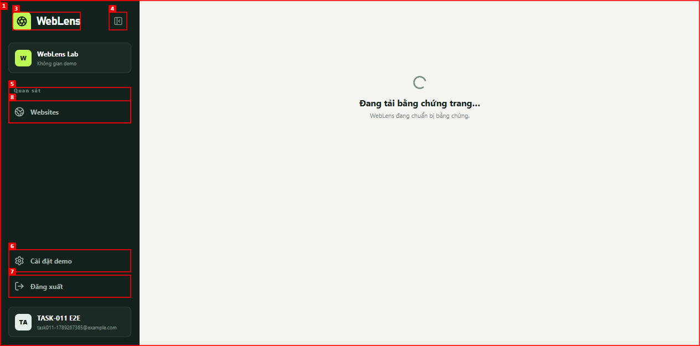
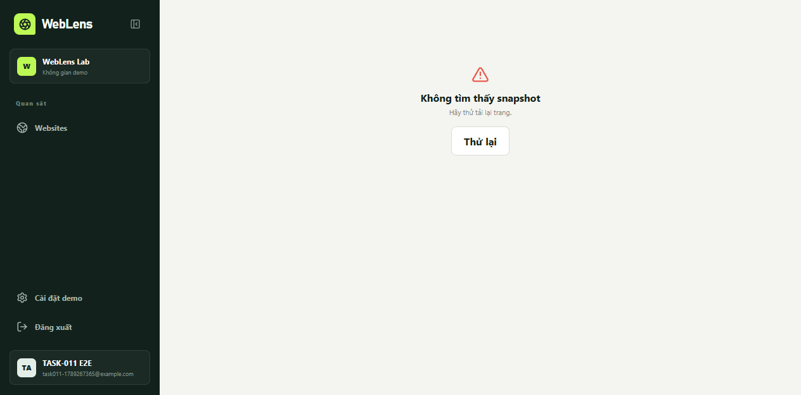

# Báo cáo E2E TASK-011: SEO, JavaScript và performance

| Trường | Giá trị |
|---|---|
| Ngày kiểm tra | 2026-09-13 |
| Ứng dụng | `http://127.0.0.1:5173` |
| Phiên browser | `task011-464ce09cdf93` |
| Phạm vi | Đăng ký → website → scan → page evidence → browser capture → snapshot |

## Tổng hợp

| Mức độ | Số lượng |
|---|---:|
| Đã phát hiện | 3 |
| Đã sửa và xác minh lại | 3 |
| Còn mở | 0 |

## Kết quả

Luồng E2E hoàn tất. Ba lỗi được phát hiện trong page evidence và snapshot, đã sửa
và xác minh lại trước khi kết thúc task.

### ISSUE-001: Trạng thái indexability hiển thị ngược với reason code

| Trường | Giá trị |
|---|---|
| Mức độ | Trung bình |
| Nhóm | Chức năng / nội dung |
| URL | `/app/pages/16682778-2c03-4670-bae5-affd3c6b3e2c` |
| Video tái hiện | Không áp dụng |

**Mô tả**

Trang công khai trả reason `INDEXABLE` nhưng UI hiển thị “Không thể lập chỉ mục”.
Nguyên nhân là Go trả field `isIndexable` trong khi contract Spring đọc
`indexable`. Đã thống nhất public contract thành `indexable` và thêm contract test.

**Bằng chứng**

1. Mở page evidence sau một scan thành công.
   
2. Quan sát dòng “Không thể lập chỉ mục · INDEXABLE”.

**Xác minh bản sửa**

- Go public contract trả field `indexable` và có contract test chống regression.
- UI hiện “Có thể lập chỉ mục · INDEXABLE”; chuỗi sai không còn xuất hiện.
- Bằng chứng sau sửa: `screenshots/10-page-evidence-fixed.png`.

### ISSUE-002: Breadcrumb page evidence trỏ tới scan demo cố định

| Trường | Giá trị |
|---|---|
| Mức độ | Trung bình |
| Nhóm | Điều hướng |
| URL | `/app/pages/16682778-2c03-4670-bae5-affd3c6b3e2c` |
| Video tái hiện | Không áp dụng |

**Mô tả**

Breadcrumb ghi “Scan #103” và trỏ tới dữ liệu demo thay vì scan thật. Đã đổi sang
`page.scanId` của evidence hiện tại.

**Bằng chứng**

1. Mở page evidence sau một scan thành công.
   
2. Quan sát breadcrumb “Scan #103” dù URL page thuộc scan UUID khác.

**Xác minh bản sửa**

- Breadcrumb dùng `page.scanId` và trỏ tới
  `/app/scans/ab5d29ed-af49-4f8d-9336-25087e728bdd`.
- Bằng chứng sau sửa: `screenshots/10-page-evidence-fixed.png`.

### ISSUE-003: Liên kết snapshot dùng ID demo thay vì capture thật

| Trường | Giá trị |
|---|---|
| Mức độ | Cao |
| Nhóm | Chức năng / điều hướng |
| URL | `/app/pages/16682778-2c03-4670-bae5-affd3c6b3e2c` |
| Video tái hiện | Không áp dụng |

**Mô tả**

Nút “Xem snapshot mẫu” dẫn tới `/app/snapshots/snapshot-1`. Snapshot demo không
tồn tại trên runtime thật nên trang đích báo “Không tìm thấy snapshot”, dù page đã
có capture E2E hoàn tất `6132a7d3-591e-481a-8131-628d5401068a`.

**Bằng chứng**

1. Mở page evidence rồi chọn “Xem snapshot mẫu”.
2. Quan sát URL `/app/snapshots/snapshot-1` và thông báo “Không tìm thấy snapshot”.
   

**Xác minh bản sửa**

- Page evidence gọi endpoint owner-scoped để lấy capture `COMPLETED` hoặc
  `PARTIAL_SUCCESS` mới nhất theo scan/page.
- Liên kết “Xem snapshot gần nhất” trỏ tới capture thật
  `6132a7d3-591e-481a-8131-628d5401068a`, không còn dùng `snapshot-1`.
- Snapshot và screenshot đều trả HTTP `200`; ảnh được render qua Blob URL với
  kích thước tự nhiên 1365×768.
- Không có JavaScript error, console warning hoặc network request lỗi trong lần
  xác minh cuối.
- Bằng chứng sau sửa: `screenshots/12-snapshot-latest-fixed.png`.

## Bằng chứng dữ liệu E2E

Capture `6132a7d3-591e-481a-8131-628d5401068a` đã được đối chiếu xuyên hệ thống:

| Thành phần | Kết quả |
|---|---|
| Control Plane PostgreSQL | `COMPLETED`, analytics `READY`, 3 inbox event `APPLIED` |
| Capture PostgreSQL | `COMPLETED`, attempt 1, 3 event `DELIVERED`, analytics outbox `DELIVERED` |
| ClickHouse | 1 rendered row, 1 network row, 0 resource-body row và receipt khớp |
| MinIO | `rendered.html` 559 byte và `screenshot.jpg` 17.180 byte |

Performance lab của snapshot:

- LCP: 376 ms, trạng thái `AVAILABLE`.
- TTFB: 106 ms, trạng thái `AVAILABLE`.
- CLS: `UNAVAILABLE` với reason `NO_LAYOUT_SHIFT_ENTRY`, không bị hiển thị sai
  thành phép đo bằng 0.
- Profile `desktop-lab-v1`, viewport 1365×768, Chromium `153.0.8010.12`.

## Kiểm thử tự động cuối

| Bộ kiểm thử | Kết quả |
|---|---|
| Backend Maven `verify` bằng Java 21 | 40 unit/security + 18 integration, tất cả đạt |
| Go `go test ./...` + `go vet ./...` | Unit + PostgreSQL/ClickHouse integration đạt |
| Frontend lint/test/build | Không cảnh báo, 12/12 test đạt, production build đạt |
| Capture Worker | Typecheck/build đạt, 3 unit + 1 PostgreSQL integration đạt |
| Dependency audit frontend + Capture Worker | 0 vulnerability production |
| `git diff --check` | Đạt; chỉ có cảnh báo chuyển LF/CRLF của Git trên Windows |
| UTF-8 guard | Đạt trên source, config, migration, tài liệu và script |
| Secret scan | 0 phát hiện độ tin cậy cao; máy chưa cài `gitleaks` |

Integration test Capture chạy trong schema PostgreSQL tạm và tự xóa. Không có
job/event tổng hợp tồn dư trong database runtime.

## Giới hạn kết luận

E2E này chứng minh correctness của lát cắt chức năng và đường dữ liệu, không chứng
minh capacity production. Benchmark saturation 100.000 page, 10 browser worker và
burst 2 capture/giây phải chạy riêng với hardware profile và metric hệ thống trước
khi công bố SLO.
